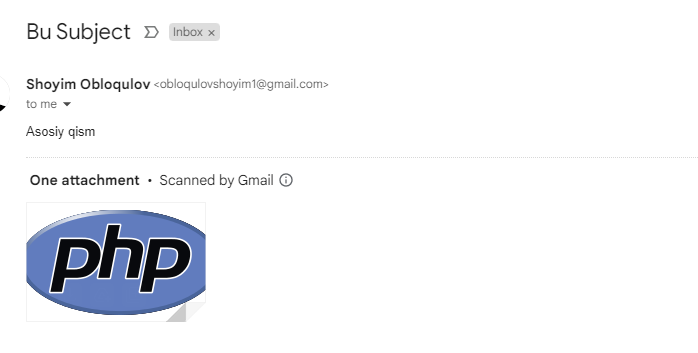

# Send emails with multiple To, CC, BCC, and Reply-to addresses
### Yuborilgan xabar quydagicha ko'rinishga ega.

### Installation & loading

<code>composer.json</code> ichiga quydagicha qilib qo'shing

<pre>"phpmailer/phpmailer": "^6.9.1"</pre>

Yoki

<pre>git clone https://github.com/shoyimobloqulov/send-email</pre>
## Running
<pre>cd send-email</pre>
<pre>php .\send-messsage.php</pre>

## Batafsil tanishish uchun
https://github.com/PHPMailer/PHPMailer
